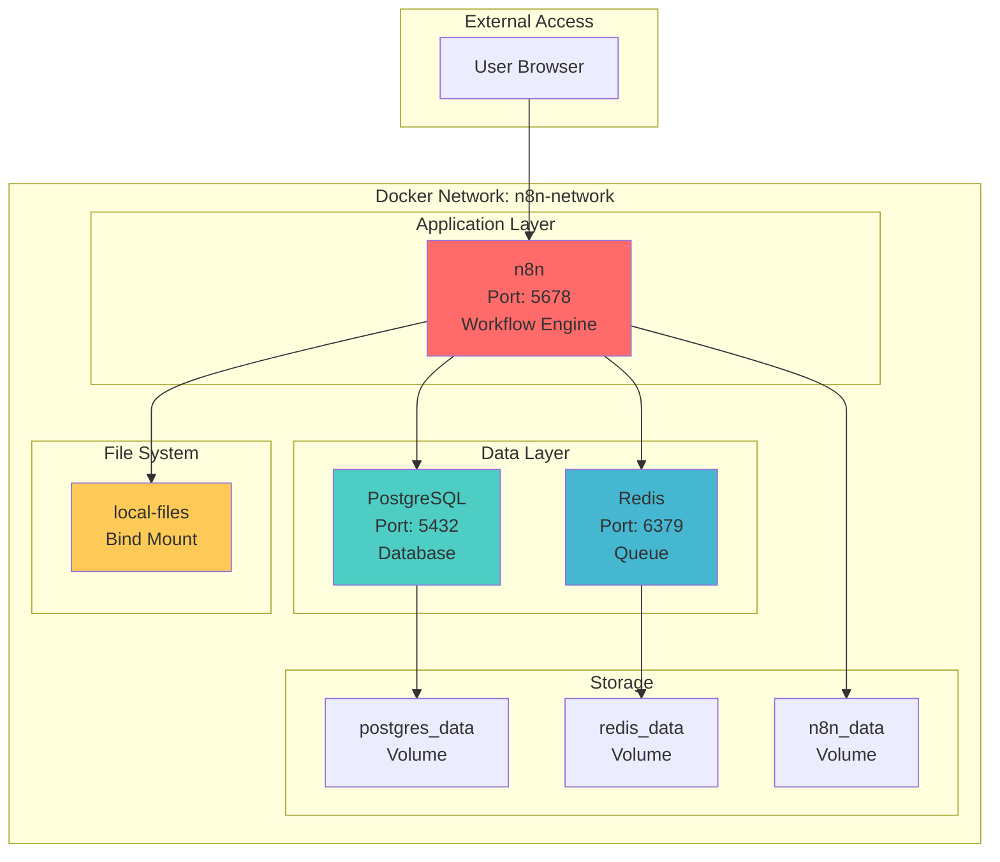

# n8n Docker Compose Local Development Environment

A simple Docker Compose setup for running n8n workflow automation locally with PostgreSQL database and Redis queue. This setup is designed for local development, experimentation, and testing.

⚠️⚠️ **NOT FOR PRODUCTION USE** ⚠️⚠️

This setup follows the official n8n guidance for Docker and Docker Compose. See: Docker + PostgreSQL notes and supported DB settings, and Docker Compose with Traefik for TLS in production-like setups. References are linked inline throughout this README.

## 🚀 Features

- **n8n Workflow Automation**: Latest version with configurable version selection
- **PostgreSQL Database**: Persistent data storage with health checks
- **Redis Queue**: Background job processing and queue management
- **File Sharing**: Local file system integration for n8n workflows
- **Environment Variables**: Fully configurable through `.env` file
- **Health Checks**: All services include health monitoring
- **Development Ready**: Optimized for local development and debugging

## 🏗️ Architecture



## 📋 Prerequisites

- **Docker**: Version 20.10+ with Docker Compose v2
- **Docker Compose**: Version 2.0+
- **Ports Available**: 80, 443, 5678, 5432, 6379, 8080
- **Memory**: Minimum 2GB RAM recommended
- **Disk Space**: At least 1GB free space

## 🚀 Quick Start

### TL;DR - Bare Minimum Commands

```bash
# Clone and setup
git clone https://github.com/Jeskz0rd/n8n-docker-composer.git
cd n8n-docker-composer

# Copy environment file
cp env.template .env

# Start everything
docker compose up -d

# Access n8n
open http://localhost:5678
```

### Detailed Setup Steps

1. **Clone the repository**
   ```bash
   git clone https://github.com/Jeskz0rd/n8n-docker-composer.git
   cd n8n-docker-composer
   ```

2. **Configure environment variables**
   ```bash
   cp env.template .env
   # Edit .env file with your preferred settings (optional)
   ```

3. **Start the services**
   ```bash
   docker compose up -d
   ```

4. **Verify services are running**
   ```bash
   docker compose ps
   ```

5. **Access the applications**
- **n8n Interface (default)**: http://localhost:5678

   - **PostgreSQL**: localhost:5432
   - **Redis**: localhost:6379

## 🔧 Configuration

### Environment Variables

| Variable | Description | Default Value |
|----------|-------------|---------------|
| **Domain Configuration** |
| `DOMAIN_NAME` | Top-level domain for services | `localhost` |
| `SUBDOMAIN` | Subdomain for n8n | `n8n` |
| `SSL_EMAIL` | Email for SSL certificates | `dev@localhost` |
| `GENERIC_TIMEZONE` | Timezone for n8n | `UTC` |
| **n8n Configuration** |
| `N8N_VERSION` | n8n Docker image version | `1.112.4` |
| `N8N_HOST` | n8n hostname | `localhost` |
| `N8N_PORT` | n8n port | `5678` |
| `N8N_PROTOCOL` | Protocol (http/https) | `http` |
| `N8N_LOG_LEVEL` | Logging level (debug/info/warn/error) | `info` |
| `N8N_LOG_OUTPUT` | Log output format | `console` |
| `N8N_ENCRYPTION_KEY` | Encryption key for n8n | `your-encryption-key` |
| `N8N_USER_MANAGEMENT_DISABLED` | Disable user management | `false` |
| **Database Configuration** |
| `N8N_DB_TYPE` | Database type | `postgresdb` |
| `N8N_DB_POSTGRESDB_HOST` | PostgreSQL host | `postgres` |
| `N8N_DB_POSTGRESDB_PORT` | PostgreSQL port | `5432` |
| `N8N_DB_POSTGRESDB_DATABASE` | Database name | `n8n` |
| `N8N_DB_POSTGRESDB_USER` | Database user | `n8n` |
| `N8N_DB_POSTGRESDB_PASSWORD` | Database password | `n8n_password` |
| **Redis Configuration** |
| `N8N_QUEUE_BULL_REDIS_HOST` | Redis host for queue | `redis` |
| `N8N_QUEUE_BULL_REDIS_PORT` | Redis port | `6379` |
| `N8N_QUEUE_BULL_REDIS_DB` | Redis database number | `0` |
| `REDIS_PASSWORD` | Redis password | `redis_password` |
| **PostgreSQL Configuration** |
| `POSTGRES_VERSION` | PostgreSQL Docker image version | `16-alpine` |
| `POSTGRES_DB` | PostgreSQL database name | `n8n` |
| `POSTGRES_USER` | PostgreSQL username | `n8n` |
| `POSTGRES_PASSWORD` | PostgreSQL password | `n8n_password` |
| **Redis Configuration** |
| `REDIS_VERSION` | Redis Docker image version | `8-alpine` |
 
### Customizing n8n Version

To use a specific n8n version, update the `.env` file:

```bash
# Use a specific version (default)
N8N_VERSION=1.112.4

# Use the latest stable version
N8N_VERSION=latest

# Use a specific tag
N8N_VERSION=1.0.0-alpine
```

Compatibility: n8n supports multiple databases and versions. For details and variables, see [Supported databases and settings](https://docs.n8n.io/hosting/configuration/supported-databases-settings/). The included compose uses PostgreSQL 16 and Redis 8 which are broadly compatible with current n8n releases.

Latest version source: Check the official n8n releases here: [n8n Releases on GitHub](https://github.com/n8n-io/n8n/releases).

## 🛠️ Basic Docker Compose Commands

### Starting and Stopping Services

```bash
# Start all services in the background
docker compose up -d

# Stop all services
docker compose stop

# Restart all services
docker compose restart

# Stop and remove all containers and volumes (WARNING: This deletes all data)
docker compose down -v
```

### Viewing Logs and Status

```bash
# View logs for all services
docker compose logs -f

# View logs for specific service
docker compose logs -f n8n
docker compose logs -f postgres
docker compose logs -f redis

# Check service status
docker compose ps

# Check service health
docker compose exec n8n wget -q --spider http://localhost:5678/healthz
```

### Accessing Services

```bash
# Access n8n container shell
docker compose exec n8n sh

# Access PostgreSQL database
docker compose exec postgres psql -U n8n -d n8n

# Access Redis CLI
docker compose exec redis redis-cli

```

## 💾 Database Backup and Restore

### Backup PostgreSQL Database

**Command:**
```bash
docker compose exec postgres pg_dump -U n8n n8n > backup_$(date +%Y%m%d_%H%M%S).sql
```

Windows (PowerShell):
```powershell
$ts = Get-Date -Format yyyyMMdd_HHmmss
docker compose exec postgres pg_dump -U n8n n8n | Out-File -FilePath "backup_$ts.sql" -Encoding ascii
```

**What it does:** Creates a complete backup of your n8n PostgreSQL database including all workflows, credentials, and execution history.

**Expected output:**
```
# The command will create a file like: backup_20241223_143022.sql
# No output means success - check for the backup file in your current directory
```

**Example:**
```bash
$ docker compose exec postgres pg_dump -U n8n n8n > backup_20241223_143022.sql
$ ls -la backup_*.sql
-rw-r--r-- 1 user user 12345 Dec 23 14:30 backup_20241223_143022.sql
```

### Restore PostgreSQL Database

**Command:**
```bash
docker compose exec -T postgres psql -U n8n -d n8n < backup_file.sql
```

Windows (PowerShell):
```powershell
Get-Content backup_file.sql | docker compose exec -T postgres psql -U n8n -d n8n
```

**What it does:** Restores your n8n database from a previously created backup file.

**Expected output:**
```
# Successful restore shows no errors
# You should see SQL commands being executed
```

**Example:**
```bash
$ docker compose exec -T postgres psql -U n8n -d n8n < backup_20241223_143022.sql
SET
SET
SET
SET
SET
SET
CREATE TABLE
CREATE TABLE
# ... more SQL commands ...
```

### List Available Backups

```bash
# List all backup files
ls -la backup_*.sql

# Example output:
# -rw-r--r-- 1 user user 12345 Dec 23 14:30 backup_20241223_143022.sql
# -rw-r--r-- 1 user user 15678 Dec 22 10:15 backup_20241222_101500.sql
```

## 🔍 Logging and Debugging

### Log Levels

n8n supports different log levels for debugging. Configure them in your `.env` file:

| Log Level | Description | Use Case |
|-----------|-------------|----------|
| `silent` | No output at all | ⚠️ Not recommended ⚠️ |
| `error` | Only errors | Critical issues only |
| `warn` | Errors and warnings | General monitoring |
| `info` | Useful information about progress | Default for development |
| `debug` | Most verbose output | Detailed debugging |

**Reference:** [n8n Logging Documentation](https://docs.n8n.io/hosting/logging-monitoring/logging/)

### Setting Log Levels

**For debugging issues:**
```bash
# Edit .env file
N8N_LOG_LEVEL=debug
N8N_LOG_OUTPUT=console,file

# Restart services
docker compose restart
```

Reference: Logging variables and levels per the n8n docs above.

### Viewing Logs

```bash
# View all logs
docker compose logs -f

# View only n8n logs
docker compose logs -f n8n

# View logs with timestamps
docker compose logs -f --timestamps

# View last 100 lines
docker compose logs --tail=100 n8n
```

## 🔍 Troubleshooting

### Common Issues

1. **Port conflicts**: Ensure ports 80, 443, 5678, 5432, 6379, 8080 are available
2. **Permission issues**: On Linux/macOS, ensure Docker has proper permissions
3. **Memory issues**: Increase Docker memory allocation if services fail to start
4. **Database connection**: Wait for PostgreSQL to be fully initialized before n8n starts

### Debugging Steps

1. **Check service logs**:
   ```bash
   docker compose logs n8n
   docker compose logs postgres
   docker compose logs redis
   ```

2. **Verify service health**:
   ```bash
   docker compose ps
   ```

3. **Check network connectivity**:
   ```bash
   docker compose exec n8n ping postgres
   docker compose exec n8n ping redis
   ```

4. **Reset everything**:
   ```bash
   docker compose down -v
   docker compose up -d
   ```

## 📁 File Structure

```
n8n-docker-composer/
├── docker-compose.yml          # Main Docker Compose configuration
├── env.template                # Environment variables template
├── .env                        # Your environment variables (create from env.template)
├── .gitignore                  # Git ignore rules
├── local-files/                # Shared files directory
│   └── .gitkeep                # Keep directory in git
├── postgres-init/              # PostgreSQL initialization scripts
│   └── 01-init.sql             # Database setup script
└── README.md                   # This file :)
```

## 🚨 Security Notes

⚠️ **This setup is for LOCAL DEVELOPMENT ONLY**

- Default passwords are used
- SSL certificates are self-signed
- User management is enabled by default
- No firewall rules are applied
- All services are exposed on localhost

## 📚 Additional Resources

- [n8n Official Documentation](https://docs.n8n.io/)
- [n8n Docker Installation Guide](https://docs.n8n.io/hosting/installation/docker/)
- [Supported databases and settings](https://docs.n8n.io/hosting/configuration/supported-databases-settings/)
- [Logging and log levels](https://docs.n8n.io/hosting/logging-monitoring/logging/)
- [Docker Compose with Traefik](https://docs.n8n.io/hosting/installation/server-setups/docker-compose/)
- [Traefik Documentation](https://doc.traefik.io/traefik/)

## 🚧 Future Work

- Introduce Traefik reverse proxy with TLS (future enhancement)
- Add Prometheus and Grafana stack for monitoring

## 🤝 Contributing

1. Fork the repository
2. Create a feature branch
3. Make your changes
4. Test thoroughly
5. Submit a pull request

## 📄 License

This project is licensed under the MIT License - see the [LICENSE](LICENSE) file for details.

---

**Happy automating with n8n! 🚀**

**Have fun :)**
